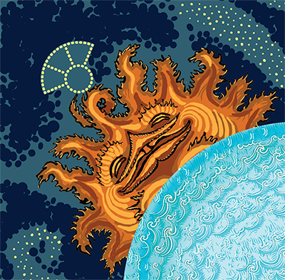
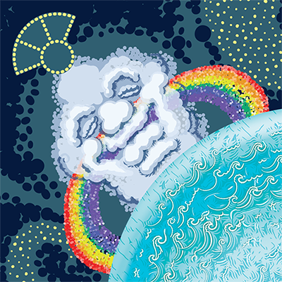
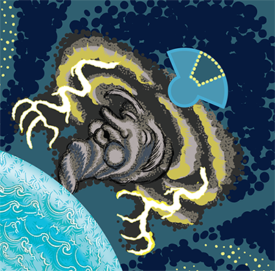
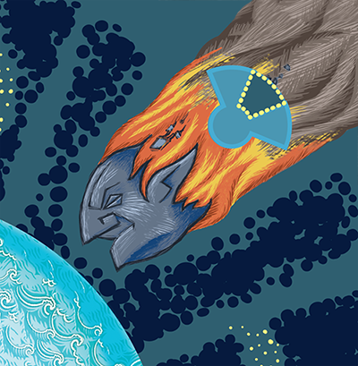
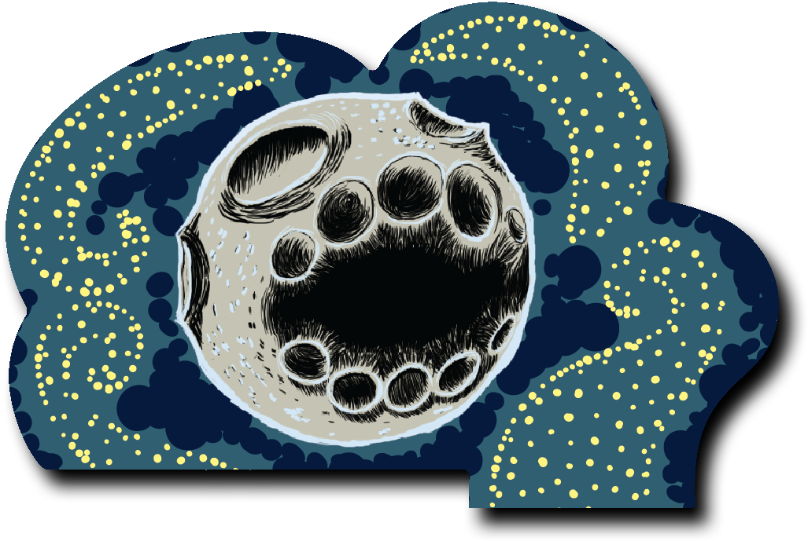

# An unpublished board game by Nemo Rathwald
## designer of ["Overworld"](https://www.magicmeeplegames.com/overworld.html)
### 2 to 4 players
### 40 to 60 minutes
### Ages 12 and up

Rotate the planet board & select a Sky Object, to use its action on the land beneath it, to fill the desolate planet of Gaia with verdant life. Arrange your carnivores, herbivores, and plants, to eat your opponents, and survive on the highest stacks of land tiles. But beware Vora, the Feastmoon!

*The latest prototype will demo at:*
- *The Loaded Die Con - Corktown, MI, October 13 and 14, 2018.*
- *U-Con Board Game Convention - Ypsilanti, MI, November 9 through 11, 2018.*
- *Penguicon - Southfield, MI, May 3 through 5, 2019.*

# Gaia-Vora Game Rules
### February 13, 2019
### Illustrated by Matt Arnold

## OBJECTIVE

On the barren Planet of Gaia, players are Nature Spirits creating lush verdant lands, and giving rise to Life-Forms which come in three Species: CarniVores, HerbiVores, and Plants. But the swollen Moon, Vora, gazes hungrily from the night sky. It is jealous of Gaia's life, and influences Species to eat each other!

The objective of the game is for your Life-Forms to:

- Eat the Life-Forms of your opponents,
- Survive to the end of the game without being eaten or killed.
- Stand on top of many layers of Tiles.

The central rule is: **Life-Forms of the same species may not share the same Tile, or the Water.**

The biggest Tile is Planet Carousel itself, which is one big Water Tile. The Water, as well as each stack of Land Tiles, may only have one CarniVore, one HerbiVore, and one Plant standing on its exposed surface.

At the end of the game, you want your Life-Forms to live at high altitudes atop stacks of Tiles. Land Tiles may not stack on top of other Tiles of the same color. And so the highest possible altitude is a stack of one Snow Tile, one Grass Tile, one Sand Tile, one Stone Tile, and the Water of the Planet Carousel itself. At game end, these five layers would confer five points to each Life-Form standing atop that stack, which is the maximum that any Life-Form can be worth.

Each Life-Form you have killed and placed on your Fossil Card is worth one point.

## COMPONENTS

- 1 cardboard Sky Board
- 1 cardboard Planet Carousel
- 1 wooden north-pole Axle Peg
- 1 cardboard ratchet-stopping Flap with a Moon printed on it
- 48 Life-Form Figures in 4 player colors:
- 12 CarniVore Figures (3 in each color)
- 16 HerbiVore Figures (4 in each color)
- 20 Plant Figures (5 in each color)
- 16 Stars
- 4 Fossil Cards in 4 player colors
- 15 Land Tiles:
  - 3 Snow (white)
  - 4 Grass (green)
  - 4 Sand (orange)
  - 4 Stone (grey)

## SETUP

1.  Take the ratchet-stopping flap, depicting Vora, the Moon. Insert its tab into the slot on the Sky Board. This ensures that the Planet Carousel can only rotate clockwise.

2.  Stack the Planet Carousel on the Sky Board. Insert the wooden dowel Peg through the holes in both layers so that the Planet Carousel can rotate on the Sky Board.

3.  Cover all the Water around the perimeter of the Planet with Stone and Sand Tiles, alternating. Align each Land Tile with one of the eight sawteeth around the Planet's edge.

4.  Set aside the Snow and Grass Tiles within reach of the players.

5.  Give each player 12 Life-Form Figures in their color: 3 CarniVores, 4 HerbiVores, and 5 Plants. Each player places their Life-Forms on the table in front of them. This is their **Reincarnation Pool**.

6.  Give each player a Fossil Card with a border in their color, with diagrams showing what the Sky Objects do. The Card also has a section showing buried Fossils; this Fossil area is where players will keep Life-Forms from their opponents which they have killed.

*For a game with fewer than four players, set up the Fossil Cards and Reincarnation Pools for unused player colors, the Bots. The Bots never take any turns or make any decisions, but Bot Life-Forms are available to place on the Planet using the Rainbow. If the Moon causes players’ Life-Forms to be eaten by a Bot’s Life-Forms, they go on that Bot’s Fossil Card. Bots cannot win the game.*

## TAKING A TURN

Players take turns in clockwise order.

1. Begin your turn by rotating the Planet Carousel.

To begin your turn, rotate the Planet one, two, or three steps. Each step trips the ratchet-stopper once. You must spend a Star to stop at one step, or to rotate the Planet three steps. If you rotate the Planet two steps, you do not need to spend a Star. Once spent, Stars are gone for the rest of the game, so use them carefully!

2. End your turn by activating the Sun, Rainbow, Storm, or Meteor.

The corners of the board are "Sky Objects". Each Sky Object (Sun, Rainbow, Storm, or Meteor) has a different power. After you have rotated the planet, choose a Sky Object, and activate its power on the Tile beneath it. Life-forms are born under the Rainbow and the Sun, migrate out from under the Storm, and get blown up when the Meteor drops a Tile on them. But you may only activate one of these Sky Objects per turn. See the following pages for how to activate the power of the Sky Object you chose.

(You may not select the Moon, because the Moon always activates its power no matter what you choose. Life-Forms only eat each other under the Moon, which will be discussed later.)

*If it is not possible to completely fulfill the instructions of a Sky Object, carry them out as much as possible. Skip any steps that are impossible.*

*However, you may not select that Sky Object at a time when every step of it would be impossible; you are not allowed to select a Sky Object whose activation would cause nothing to change.*

*You are required to take as many steps as you can. If taking the steps in a different order would result in subsequent steps being impossible, you must take steps in whichever order lets you do the most. However, if your opponents don’t point it out, then it was legal.*

If the Sky Object you chose is above Water, it affects everywhere on the Planet Carousel which are not covered by Land Tiles. All of the Water is one big Water Tile. Being on the edge is the same location as being in the center. You may scoot all the meeples in the Water into the center at any time, if that helps you remember.

After resolving the Sky Object you chose, play passes to the next player.

The game is over at the end of the turn when all the Snow and Grass Tiles are on the Planet (See “Scoring”.)

## THE SUN OR THE RAINBOW

If you chose to activate the Sun or Rainbow, add four Life-Forms (CarniVores, HerbiVores, or Plants) to the Planet: one on the Tile directly under the Sun or Rainbow, and one on the visible surface of each Tile touching that Tile, including Water.

If using the Sun, all four Life-Forms must be your own color. If using the Rainbow, all four Life-Forms must be in different colors.

**Each Tile may only have one of each species standing on it.** *That means you might not place the maximum possible number of Life-Forms, if there is not room.*

*The uncovered surface of the Planet Carousel is one big Water Tile, connected through the center of the Planet Carousel. So, check if any the Water already contains the species you are trying to add to the Water.*

*If the Sun or Rainbow are over the exposed edge of the Water, this provides you with maximum options. Keep in mind that Water is adjacent to everything. Therefore, all of the locations on the Planet qualify as locations where you may add the four Life-Forms. You may choose which four locations receive the four Life-Forms, and which do not.*

## THE STORM

If you chose to activate the Storm, move all Life-Forms out of the Tile under the Storm. Move them into any Tiles that Tile is next to, which may include Water. (The Water is next to everything.)

*This is a world where plants can walk.*

*A Life-Form may not move onto a Tile which already has its species.*

*It may always move onto the uncovered Water surface of the Planet Carousel, if its species is not already there.*

*You must move out all the Life-Forms, even if you do not want to move all of them.*

## THE METEOR

When you activate the Meteor, you will stack a Tile onto the location under the Meteor.

It may be a Snow or Grass Land Tile which is off the board.

It may be a single Sand or Stone Tile, from its starting location on the Planet. All the Life-forms standing on it are carried along, and live in the new location.

You may not create a stack with duplicates of the same Tile.

The Life-Forms which were standing on the Tile where this Tile landed are all killed by this Tile falling on them. The killed Life-Forms go onto the Fossil area on the Fossil Card of the player whose turn it is.

Water is an exception: Life-Forms in the Water will always swim into the center of the Planet, gather around the Axle Peg, and survive the Meteor dropping a Tile on Water.

# THE MOON

The player may not choose to activate the Moon. Instead, it activates itself to cause Eating in the location under it, at the end of each turn, and after every rotation step of the planet. Players do not get a choice about the Moon’s effect.

Whenever CarniVores or HerbiVores are beneath the Moon, they immediately attempt to Eat! As long as they are NOT under the Moon, a CarniVore peacefully co-exists with a HerbiVore, and a HerbiVore co-exists with a Plant. But the Planet’s rotation steadily advances these peaceful locations clockwise, closer and closer to the Moon, where Eating occurs:

The player who owns the HerbiVore (if any) awards its player with ownership of the Plant (if any). Then the player who owns the CarniVore (if any) awards its player with ownership of the HerbiVore (if any).

*Plants do not eat anything. Nothing eats CarniVores; they cannot be eaten. *

When any player’s Life-Forms eat another Life-Form, the eaten Life-Form is awarded to the player whose color did the eating, even if that is not the player whose turn it is. The player whose Life-Form did the eating will keep the eaten Life-Form on their Fossil Card.

*When a Bot player’s Life-Forms eat other Life-Forms, put them on the Fossil area on the Bot player’s Fossil Card.*

*Life-Forms are also able eat Life-Forms of the same color. They are required to do so, if given the opportunity.*

*If your Life-Forms are eaten by your own Life-Forms, return them to your Reincarnation Pool instead of putting them on your Fossil Card. They may return to the Planet with the Sun or Rainbow on a future turn.*

Water will expand all the way to the edge of the Planet Carousel when Land Tiles of Stone and Sand stack on other Tiles throughout the game. Whenever an exposed Water edge is under the Moon’s position, Eating occurs in the Water.

Eating also occurs instantly when a player uses the Sun or Rainbow to add Life-Forms into the Water when it is under the Moon-- or, when a player uses the Storm to move Life-Forms into the Water when it is under the Moon, or out of the Water onto a Land Tile under the Moon.

## Examples:

*At the start of the turn, the Yellow player rotates the Planet three steps.*

*On the first rotation step, a Land Tile rotates into position under the Moon. It has a Green CarniVore, a White HerbiVore, and a Yellow Plant. The White player is awarded the Yellow Plant, and the Green player is awarded the White HerbiVore. These go into their Fossils (scoring areas).*

*On the second rotation step, a Land Tile rotates into position under the Moon, which has a Yellow CarniVore and a Yellow Plant. CarniVores do not eat Plants, so nothing gets eaten here.*

*On the third rotation step, there is no Land Tile that rotates into position under the Moon; instead, what rotates under the Moon is the bare surface of the Planet Carousel, which is Water. So, eating occurs in the Water. There is a Yellow HerbiVore and a Green Plant in the Water. Yellow is awarded the Green Plant. These go into their Fossils (scoring areas).*

*Yellow activates Storm. The Storm is over a Land Tile with a Yellow CarniVore and a White Plant. Yellow moves them both of them into the Water. This instantly results in eating, because the Moon is over the Water. The Yellow HerbiVore (which as you recall, just got done eating the Green Plant in the last step) awards the White Plant to Yellow. Then the Yellow CarniVore eats the Yellow HerbiVore.*

*This returns the Yellow HerbiVore to Yellow. Because it is Yellow’s own color, it is returned to its reincarnation pool, not awarded as points in Yellow’s Fossils. A Fossil area is only for keeping one’s opponents’ Life-Forms, not one’s own.*

## SCORING

The game is over when the last Land Tile is added to the Planet.

Each of your opponents’ Life-Forms you killed and placed on your Fossil Card adds one point to your score.

Each of your Life-Forms alive on the Planet adds one point to your score, for each Tile under it, including the Planet Carousel itself. So each one on the Water is worth one point, each one on a single layer of Land is worth two points, etc.

The winner is the player with the highest score. Ties are broken in favor of the player with the most Life-Forms on the Planet.

*Example: Amy has a CarniVore, a HerbiVore, and a Plant on a stack of Snow/Grass/Sand/Stone/Water. Those five layers mean each Life-form is worth five points, for a total of fifteen points.*

## Q&amp;A:

Q: Are the players gods? Or aliens?

A: I would need to meet you to venture an opinion.
