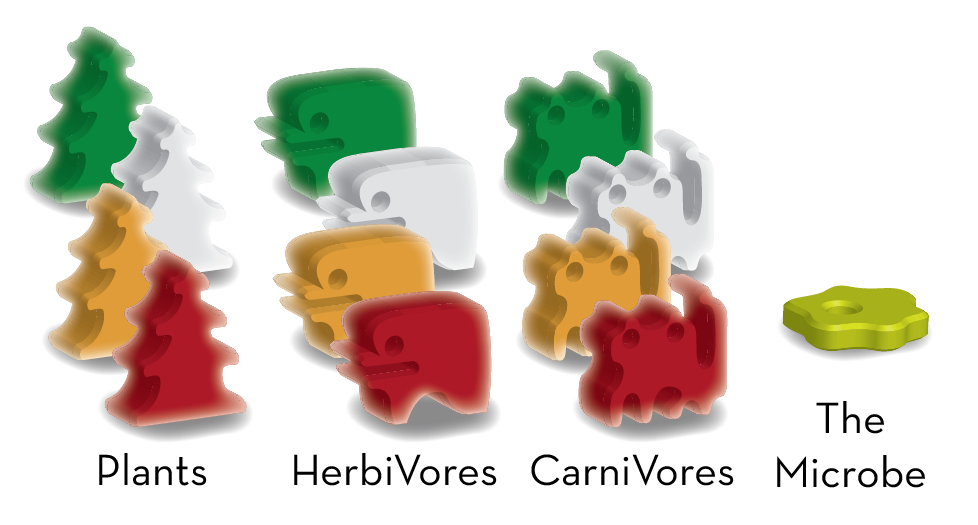
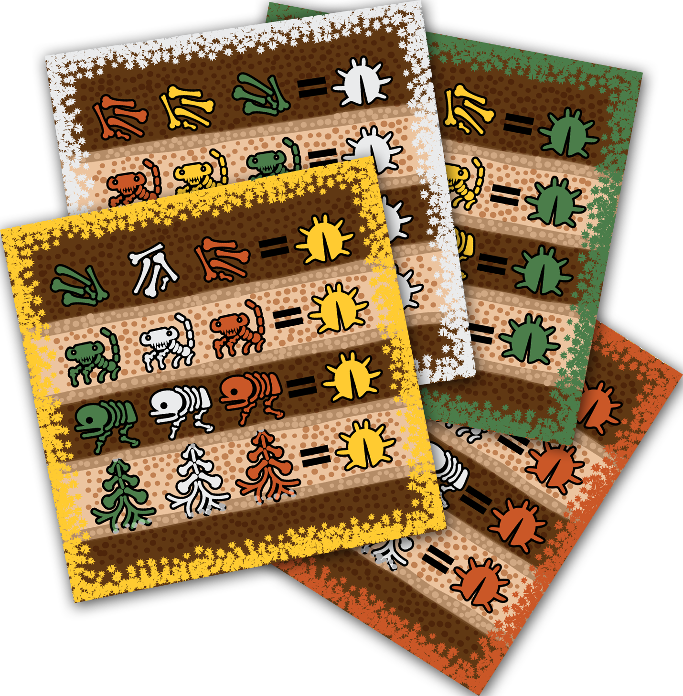
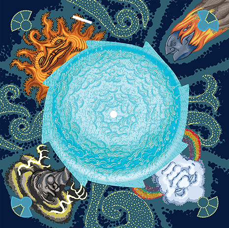

# Gaia-Vora Game Rules
### Designed by Nemo Rathwald
### Illustrated by Matt Arnold

## OBJECTIVE

On the barren Planet of Gaia, there arose the first Life-Form: a Microbe. Players are Nature Spirits creating lush verdant lands, and giving rise to new Life-Forms which come in three Species: CarniVores, HerbiVores, and Plants. But the swollen Moon, Vora, gazes hungrily from the night sky. It is jealous of Gaia's life, and influences Species to eat each other!

The objective of the game is for your Life-Forms to:

- Eat the Life-Forms of your opponents,
- Survive to the end of the game without being eaten or killed.
- Stand on top of many layers of Tiles.

The central rule is: **Life-Forms of the same species may not share the same Tile, or the Water.**

The biggest Tile is Planet Carousel itself, which is one big Water Tile. The Water, as well as each stack of Land Tiles, may only have one CarniVore, one HerbiVore, and one Plant standing on its exposed surface.

At the end of the game, you want your Life-Forms to live at high altitudes atop stacks of Tiles. Land Tiles may not stack on top of other Tiles of the same color. And so the highest possible altitude is a stack of one Snow Tile, one Grass Tile, one Sand Tile, one Stone Tile, and the Water of the Planet Carousel itself. At game end, these five layers would confer five points to each Life-Form standing atop that stack, which is the maximum that any Life-Form can be worth.

Each Life-Form you have killed and placed on your Fossil Card is worth one point.

Also, for each row you fill in on your Fossil Card, you receive a bonus point, represented by the Insect symbol.

## COMPONENTS

- 1 cardboard Sky Board
- 1 cardboard Planet Carousel
- 1 wooden north-pole Axle Peg
- 1 cardboard ratchet-stopping Flap with a Moon printed on it
- 48 Life-Form Figures in 4 player colors:
  - 12 CarniVore Figures (3 in each color)
  - 16 HerbiVore Figures (4 in each color)
  - 20 Plant Figures (5 in each color)
- 1 Microbe Life-Form (in a neutral color)
- 16 Stars
- 4 Fossil Cards in 4 player colors
- 15 Land Tiles:
  - 3 Snow (white)
  - 4 Grass (green)
  - 4 Sand (orange)
  - 4 Stone (grey)

## SETUP

1.  Take the ratchet-stopping flap, depicting Vora, the Moon. Insert its tab into the slot on the Sky Board. This ensures that the Planet Carousel can only rotate clockwise.

2.  Stack the Planet Carousel on the Sky Board. Insert the wooden dowel Peg through the holes in both layers so that the Planet Carousel can rotate on the Sky Board.

3.  Cover all the Water around the perimeter of the Planet with Stone and Sand Tiles, alternating. Align each Land Tile with one of the eight sawteeth around the Planet's edge.

4. Place the neutral-colored Microbe in the Water in the center of the planet.

5.  Set aside the Snow and Grass Tiles within reach of the players.

6.  Give each player 12 Life-Form Figures in their color: 3 CarniVores, 4 HerbiVores, and 5 Plants. Each player places their Life-Forms on the table in front of them. This is their **Reincarnation Pool**.

7.  Give each player a Fossil Card with a border in their color. The Card also has a section showing buried Fossils, where players will keep Life-Forms from their opponents which they have killed.

## TAKING A TURN

Players take turns in clockwise order.

### 1- Begin your turn by rotating the Planet Carousel. The Moon causes Life-Forms to Eat.

To begin your turn, rotate the Planet one, two, or three steps. Each step trips the ratchet-stopper once. You must spend a Star to stop at one step, or to rotate the Planet three steps. If you rotate the Planet two steps, you do not need to spend a Star. Once spent, Stars are gone for the rest of the game, so use them carefully!

After **each** rotation step, the Life-Forms in the location under the Moon eat each other. See the section "The Moon".

### 2- End your turn by activating the Sun, Rainbow, Storm, or Meteor.

The corners of the board are "Sky Objects". Each Sky Object (Sun, Rainbow, Storm, or Meteor) has a different power. After you have rotated the planet, choose a Sky Object, and activate its power on the Tile beneath it.

Life-forms are born under the Rainbow and the Sun, migrate out from under the Storm, and get blown up when the Meteor drops a Tile on them. But you may only activate one of these Sky Objects per turn. See the following sections for how to activate the power of the Sky Object you chose.

(You may not select the Moon, because the Moon always activates its power no matter what you choose. Life-Forms only eat each other under the Moon, which will be discussed later.)

*If it is not possible to completely fulfill the instructions of a Sky Object, carry them out as much as possible. Skip any steps that are impossible.*

*However, you may not select that Sky Object at a time when every step of it would be impossible; you are not allowed to select a Sky Object whose activation would cause nothing to change.*

*You are required to take as many steps as you can. If taking the steps in a different order would result in subsequent steps being impossible, you must take steps in whichever order lets you do the most. However, if your opponents don’t point it out, then it was legal.*

If the Sky Object you chose is above Water, it affects everywhere on the Planet Carousel which are not covered by Land Tiles. All of the Water is one big Water Tile. Being on the edge is the same location as being in the center. You may scoot all the meeples in the Water into the center at any time, if that helps you remember.

After resolving the Sky Object you chose, play passes to the next player.

The game is over at the end of the turn when all the Snow and Grass Tiles are on the Planet (See “Scoring”.)

## THE MOON

The player may not choose to activate the Moon. Instead, it activates itself to cause Eating in the location under it, after every rotation step of the planet. Players do not get a choice about the Moon’s effect.

Rotate one step, **eat now**. Rotate a second step, **eat again**.

In other words, Life-Forms do not **only** eat if they end this turn's rotation under the Moon **by exact count**: they also eat **as they pass** under the Moon.

As long as Life-Forms are NOT under the Moon, a HerbiVore peacefully co-exists with a Plant, a CarniVore co-exists with a HerbiVore, and the Microbe co-exists with a CarniVore. But the Planet’s rotation steadily advances these peaceful locations clockwise, closer and closer to the Moon, where Eating occurs:

The player who owns the HerbiVore (if any) takes the Plant (if any). Then the player who owns the CarniVore (if any) takes the HerbiVore (if any). The Microbe returns the CarniVore to its Reincarnation Pool.

*Plants do not eat anything. Nothing eats the Microbe; it cannot be eaten.*

When any player’s Life-Forms eat another Life-Form, the eaten Life-Form goes to the player whose color did the eating, even if that is not the player whose turn it is. When your Life-Form eats another Life-Form, keep the eaten Life-Form on your Fossil Card, covering an empty skeleton matching its species and color. (The top row of a Fossil card depicts jumbles of bones which may store any species.) If you do not have anywhere to put the Life-Form on your Fossil Card, return it to its player's Reincarnation Pool.

*Life-Forms are also able eat Life-Forms of the same color. They are required to do so, if given the opportunity.*

*If your Life-Forms are eaten by your own Life-Forms, return them to your Reincarnation Pool. They may return to the Planet with the Sun or Rainbow on a future turn.*

Water will expand all the way to the edge of the Planet Carousel when Land Tiles of Stone and Sand stack on other Tiles throughout the game. An exposed Water edge, under the Moon’s position, makes it possible for Eating to occur in the Water.

## Examples:

*At the start of the turn, the Yellow player rotates the Planet three steps.*

*On the first rotation step, a Land Tile rotates into position under the Moon. It has a Green CarniVore, a White HerbiVore, and a Yellow Plant. The White player is awarded the Yellow Plant, and the Green player is awarded the White HerbiVore. These go into their Fossils (scoring areas).*

*On the second rotation step, a Land Tile rotates into position under the Moon, which has a Yellow CarniVore and a Yellow Plant. CarniVores do not eat Plants, so nothing gets eaten here.*

*On the third rotation step, there is no Land Tile that rotates into position under the Moon; instead, what rotates under the Moon is the bare surface of the Planet Carousel, which is Water. So, eating occurs in the Water. There is a Yellow HerbiVore and a Green Plant in the Water. Yellow is awarded the Green Plant. These go into their Fossils (scoring areas).*

## THE SUN OR THE RAINBOW

If you chose to activate the Sun or Rainbow, add four Life-Forms (CarniVores, HerbiVores, or Plants) to the Planet: See the diagram drawn on the object for the four places to put them: One directly under this Sky Object, one on the location under the next Sky Space clockwise, one under the next Sky space counter-clockwise, and one in the Water.

Some of those locations may have the Land Tiles removed to expose the Water. Those locations are same location as the Water, which only receives one Life-Form. Therefore, you might place fewer than four Life-Forms.

If using the Sun, all the Life-Forms you place must be your own color. If using the Rainbow, all the Life-Forms you place must be in different colors.

**Each Tile may only have one of each species standing on it.** *That means you might not place the maximum possible number of Life-Forms, if there is not room.*

*The uncovered surface of the Planet Carousel is one big Water Tile, connected through the center of the Planet Carousel. So, check if any the Water already contains the species you are trying to add to the Water.*

## THE STORM

If you chose to activate the Storm, move all Life-Forms out of the Tile under the Storm. Move them into any Tiles that Tile is next to, which may include Water. (The Water is next to everything.)

*This is a world where plants can walk.*

*A Life-Form may not move onto a Tile which already has its species.*

*It may always move onto the uncovered Water surface of the Planet Carousel, if its species is not already there.*

*You must move out all the Life-Forms, even if you do not want to move all of them.*

*The Microbe counts as a Life-Form.*

## THE METEOR

When you activate the Meteor, you will stack a Tile onto the location under the Meteor.

It may be a Snow or Grass Land Tile which is off the board.

It may be a single Sand or Stone Tile, from its starting location on the Planet. All the Life-forms standing on it are carried along, and live in the new location.

Note: You never move a tile **from** the location of the Meteor; only **to** it.

You may not create a stack with duplicates of the same Tile color.

The Life-Forms which were standing on the Tile where this Tile landed are all killed by this Tile falling on them. The killed Life-Forms go onto the Fossil Card of the player whose turn it is.

Water is an exception: Life-Forms in the Water will always swim into the center of the Planet, gather around the Axle Peg, and survive the Meteor dropping a Tile on Water.

*The Microbe is immortal. If the Meteor stacks a tile on the Microbe, stack the Microbe atop that tile.*

## SCORING

The game is over when the last Land Tile is added to the Planet.

Each of your opponents’ Life-Forms you killed and placed on your Fossil Card adds one point to your score.

Each complete row on your Fossil Cards, containing three Life-Forms in the colors of all of your opponents, is worth one point, represented by the insect symbol.

Each of your Life-Forms alive on the Planet adds one point to your score, for each Tile under it, including the Planet Carousel itself. So each one on the Water is worth one point, each one on a single layer of Land is worth two points, etc.

The winner is the player with the highest score. Ties are broken in favor of the player with the most Life-Forms on the Planet.

*Example: Amy has a CarniVore, a HerbiVore, and a Plant on a stack of Snow/Grass/Sand/Stone/Water. Those five layers mean each Life-form is worth five points, for a total of fifteen points.*

## THREE PLAYER RULES

All rules of the base game apply unless specified here.

For a three player game, set up the Fossil Card and Reincarnation Pool for the extra player color, called "The Hibernator". Return the Hibernator's stars to the game box.

The Hibernator does not take turns or make decisions. Hibernator Life-Forms only exist to be available to place on the Planet using the Rainbow.

If the Moon causes players’ Life-Forms to be eaten by Hibernator Life-Forms, they go on the Hibernator Fossil Card. The Hibernator cannot win the game.

All other rules of the base game still apply.

## TWO PLAYER RULES

All rules of the base game apply unless specified here.

When playing with two players, each player selects two player colors, and takes all that color's game equipment, and four stars. Return the remaining stars to the game box.

When using the Sun, you must still place only one of your two colors.

When you kill Life-Forms with the Meteor or Storm, you may choose which of your Fossil Cards to put them on.

At the end of the game, score your two colors separately. Your score is whichever is lower.

## ONE PLAYER RULES

All rules of the base game apply unless specified here.

Solo Mode "Weather Cards" will be packaged and sold separately, but included by default with the base funding level of the Kickstarter.

Use the game equipment for all four colors, and four stars. Shuffle the Weather Cards and place them face-down. This is the draw pile.

To begin each turn, draw the top card of the draw pile and put it face-up in a discard pile. You may inspect the discard pile at any time. If the draw pile is empty, shuffle the discard pile to become the new draw pile, so that you can draw and discard the top card.

Weather Cards each depict a numeral, 1, 2, or 3. Rotate the Planet that many steps. You may spend a Star to cancel this number and rotate the planet 1 step or 3 steps, your choice.

Each card depicts a Sky Object-- Sand Meteor, Stone Meteor, Grass Meteor, Snow Meteor, Red Sun, Green Sun, White Sun, Yellow Sun, Storm, and Rainbow. Activate the Sky Object shown on the card, following its instruction as much as possible. If it cannot be used at all, then pass your turn.

If you draw a Meteor card, you must drop the depicted Land Tile color on the position under the Meteor, either from the supply, or an unstacked Land Tile on the Planet. If it is not legal to do so (because its color is already in that Location, or because it is all in stacks on the Planet), then pass your turn.

If you draw a Sun card, you may only use Life-Forms of the color depicted on the card, as many as legally possible. If you cannot legally place any (because that Reincarnation Pool is empty, or all the locations already have the available species in the Reincarnation Pool), pass your turn.

When you kill Life-Forms with the Meteor or Storm, you may choose which of your Fossil Cards to put them on.

There is no score in Solo Mode. If all four of your Reincarnation Pools are empty, you win! If the last Land Tile is added to the Planet by the Meteor, you lose!

## Q&amp;A:

Q: Why are there multiple colors of Land Tiles? Do they work differently?

A: You may not create a stack with duplicates of the same Tile color. Different colors exist only to limit the maximum height of a stack. Colors do not differ in any other way.

Q: Do Life-Forms eat only if the Planet's rotation lands them under the Moon by exact count?

A: Not only then. They also eat on each rotation step, as they **pass under** the Moon. Landing under the Moon by exact count is not required.

Q: Are the players gods? Or aliens?

A: I would need to meet you to venture an opinion.
